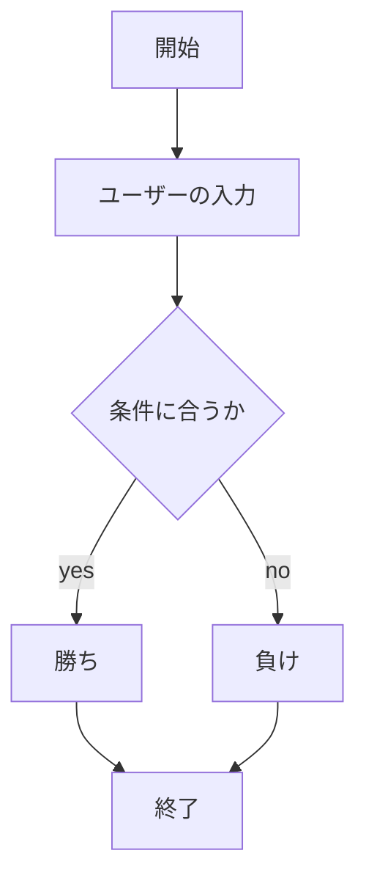
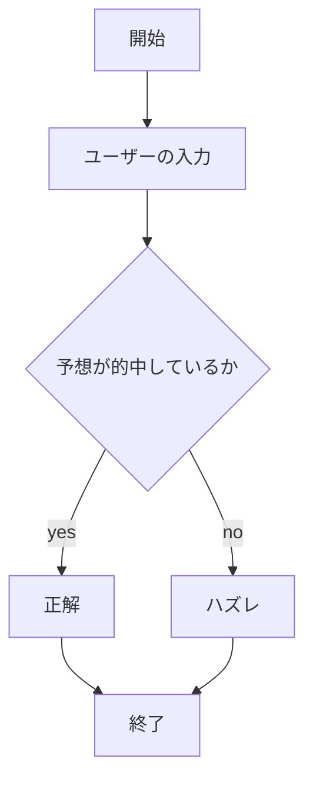
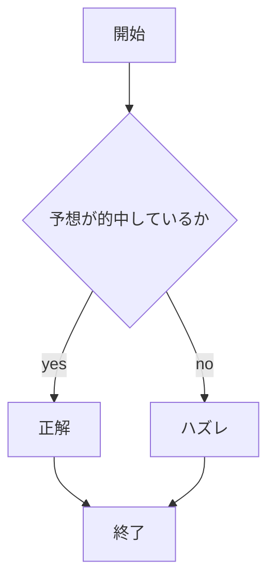

# webpro06
##　このプログラムについて
注:サーバの起動方法についてはすべてのプログラムでは同様の処理なので,janken.htmlのみで説明する.
# ファイル一覧(janken)

ファイル名|説明
-|-
app5.js|プログラム本体
public/janken.html|じゃんけん開始画面
janken.ejs|じゃんけんファイル

## 仕様書
1. サーバーの起動方法
　ターミナルを開き,cdコマンドでapp6.jsが入っているファイルに移動する.まず,「npm install ejs を実行することで、Node.jsでEJSを使用してテンプレートファイルをレンダリングできるようになります.その次に,サーバを起動するためにnodeコマンドを使い[node app6.js]と入力し実行することでローカルサーバーを起動する.このとき[Example app listening on port 8080!]と出ていれば正しく起動できている.また,サーバーを終了させるにはcontrol + cを押す.
1. Webページへログイン
ウェブブラウザを開き,検索バーに[localhost:8080/public/janken.html]を入力してページにアクセスする.
1. jankenの使い方
ページに飛ぶと最初の画面には,現在の試合数が1,勝利数が０,コンピュータの手がランダムに初期値として出力されている.その表示一覧の下部に空欄と「次は何を出す？」という表示と,送信というボタンが配置されているので,空欄の部分に次に自分が出したい手（グー,チョキ,パーの中から一つ）を入力する.その後,送信ボタンを押すとあなたの手はという部分に自分の入力した結果が出力され,コンピュータの手もランダムに出力される.このとき試合数のパラメータが1上昇し,自分の出した手がコンピュータの手に勝っていれば勝利数も1上昇される.

## ファイル一覧(number)
ファイル名|説明
-|-
app5.js|プログラム本体
public/number.html|数予想開始画面
number.ejs|数予想ファイル

## 仕様書
1. Webページへログイン
Webブラウザで[ localhost:8080/public/number.html ]にアクセスする
1. numberの使い方
ページにアクセスすると,「コンピュータの数を予想しよう」という文字列の横に,空欄の入力欄が表示されているので,1~3の数字の中から選んで入力します.入力して送信というボタンを押すと,自分の入力した数字,コンピュータがランダムに選択した数字,予想した数とコンピュータの手があったているか,外れているかの判定,試合数と勝利数が表示されます.またその下に,次の予想を入力する入力欄があるため同様の手順で,新しい予想ができる.

## ファイル一覧(whether)
ファイル名|説明
-|-
app5.js|プログラム本体
public/wehether.html|天気予想開始画面
whether.ejs|天気予想ファイル

## 仕様書
1. Webページへログイン
Webブラウザで[ localhost:8080/public/whether.html ]にアクセスする
1. whetherの使い方
ページにアクセスすると,明日の天気を予想しようという表示と,空欄の入力欄が出てくるので,晴れ,雨,曇りの中から選んで入力すると,ページが飛び,自分の入力した天気,コンピュータがランダムに選択した天気,予想が的中しているか,外れているかの判定,試合数と勝利数が表示されます.一番下の欄に,次の予想はと表示されているので,その横の入力欄に再度入力することで,新たな結果が出力され試合数と勝利数が上昇します.

