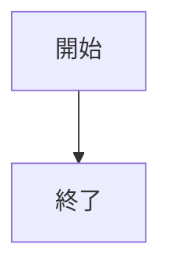
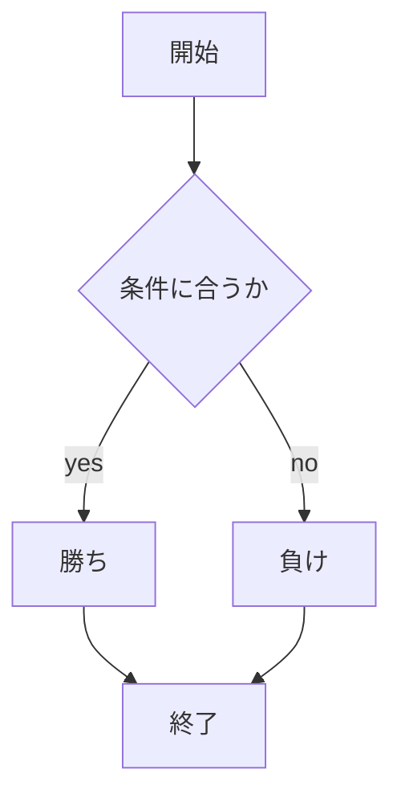

# webpro_06
10/29
# webpro06
##　このプログラムについて
# ファイル一覧

ファイル名|説明
-|-
app5.js|プログラム本体
public/janken.html|じゃんけん開始画面
janken.ejs|じゃんけんファイル
```javascript
console.log("Hello");
```
## 仕様書
1. ```app5.js``` をnodeでポート開放行う
1. 他のターミナルでポートにアクセスする
1. Webブラウザでlocalhost:8080/public/janken.htmlにアクセスする
1. 自分の手を入力する



