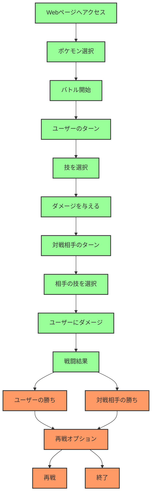
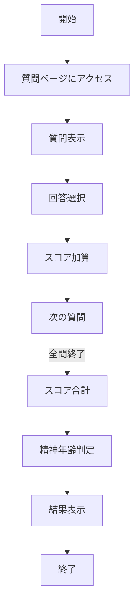

# webpro_06

ファイル名|説明
-|-
app6.js|プログラム本体
pokemon.ejs|ポケモン選択画面.
battle.ejs|バトル画面.

## 仕様書
1. Webページへログイン
Webブラウザで[ App running on http://localhost:3000 ]にアクセスする.
2.ゲームの使い方
ゲームがブラウザで表示されたら、最初にプレイヤーが使用するポケモンを選択する.選べるポケモンはこの3匹.ヒトカゲ (HP: 120)ゼニガメ (HP: 130)フシギダネ (HP: 150)
好きなポケモンを選び,「バトル開始」ボタンをクリックすると,バトルが始まる.
プレイヤーと相手ポケモンが交互に技を使って戦う.
バトルが開始されたら,自分のポケモンの持っている技を選択する.各ポケモンは4つの技を持つ.技を選ぶと,その技で相手ポケモンを攻撃する.
プレイヤーが技を使った後,相手ポケモンが反撃してくる.相手はランダムに1つの技を選んで自分のポケモンに攻撃を仕掛けてくる.
戦闘が続き,いずれかのポケモンのHPが0になるとバトルが終了する.
勝者: 相手ポケモンのHPが0になった場合,プレイヤーのポケモンが勝利となる.敗者: プレイヤーのポケモンのHPが0になった場合、プレイヤーは負けとなる.
バトル終了後,再戦することができる.「再戦」ボタンをクリックすると,再度ポケモンが選ばれ,新たなバトルが始まる.
再戦で,ポケモンのHPが初期値にリセットされ,再び戦いがはじまる.
ゲームが終了した後,ブラウザを閉じることでゲームを終了することができる.

精神年齢診断システム

このシステムは、質問に対する回答を通じて、ユーザーの精神年齢を診断するWebアプリケーションである。質問ごとに選択肢があり、ユーザーが選んだ回答に基づいてスコアを加算し、最終的に精神年齢を判定する。

ファイル構成
	•	app.js: サーバーサイドの処理を担当するメインのファイルである。Expressを使用してHTTPサーバーを起動し、質問の表示や回答の処理を行う。
	•	views/: EJSテンプレートを格納するディレクトリである。質問ページと結果ページのHTMLテンプレートがある。
	•	index.ejs: 質問と選択肢を表示するページである。
	•	result.ejs: 結果（精神年齢）を表示するページである。
	•	public/: CSSや画像などの静的ファイルを格納するディレクトリである。

システムの流れ
	1.	ユーザーが質問ページにアクセスすると、最初の質問が表示される。
	2.	ユーザーは選択肢を選んで回答し、次の質問が表示される。
	3.	最後の質問まで回答すると、ユーザーの精神年齢が計算され、その結果が表示される。
    4. サーバーの起動方法
　ターミナルを開き,cdコマンドでapp5.jsが入っているファイルに移動する.まず,「npm install ejs を実行することで、Node.jsでEJSを使用してテンプレートファイルをレンダリングできるようになります.その次に,サーバを起動するためにnodeコマンドを使い[node app5.js]と入力し実行することでローカルサーバーを起動する.このとき[Example app listening on port 3000!]と出ていれば正しく起動できている.また,サーバーを終了させるにはcontrol + cを押す.

仕様書
	1. システム概要

本システムは、ユーザーが提供する回答を基に、その精神年齢を診断するWebアプリケーションだ。ユーザーは質問に答えることでスコアを獲得し、その合計に基づいて精神年齢が判定される。最大スコアは65点であり、最終的な診断結果はこのスコアを基に評価される。

2. システムの原理

2.1 スコア加算
	•	各質問には選択肢があり、選択肢ごとに異なるスコアが設定されている。ユーザーが選んだ回答に応じてスコアが加算され、最終的にスコアの合計が算出される。
	•	最大スコアは65であり、これはすべての質問における選択肢における最高スコアを選んだ場合の合計スコアだ。

2.2 精神年齢の判定
	•	ユーザーが回答した全ての質問に対するスコアを集計した後、以下のように精神年齢を分類する：
     0～10	精神年齢が若杉
     11～20	精神年齢が地味に若杉
     21～30	精神年齢がまあ、普通やね
     31～40	この精神年齢、、、ませているな？
     41～50	精神年齢が大人びてきた
     51～60	精神年齢が非常に大人びていらっしゃる
    61以上	精神年齢がパーフェクトアダルトだ！！

精神年齢の分類は事前に設定されたスコア範囲に基づいており、最終的な診断結果が表示される。

2.3 質問の種類と構成

質問は以下のような形式で、ユーザーの好みや価値観を反映したものとなっている。
例: 「好きな食べ物は？」
	•	A. お菓子（スコア 1）
	•	B. 肉（スコア 5）
	•	C. 野菜（スコア 3）
	2.	生活スタイルに関する質問
例: 「休日の過ごし方は？」
	•	A. 映画を見る（スコア 5）
	•	B. 家で寝る（スコア 3）
	•	C. 友達と遊ぶ（スコア 1）
	3.	価値観や心の状態に関する質問

このように、質問はユーザーの生活や心情に基づく精神年齢を診断する内容のためで構成されている。

2.4 精神年齢を測定するアルゴリズム
	•	質問に対するユーザーの選択がスコアとして加算される。各質問には個別にスコアが設定されており、ユーザーが選んだ選択肢に基づいてスコアが増減する。
	•	質問の数は事前に決められており、すべての質問が完了した時点で、合計スコアが算出される。その合計スコアに基づき、精神年齢が判定される。
	•	精神年齢は、設定されたスコア範囲に基づいて分類され、最終結果として表示される。

2.5 システムのデータフロー
	1.	質問ページ
ユーザーが最初にアクセスすると、最初の質問が表示される。ユーザーは表示された選択肢から一つを選び、その選択肢に対応するスコアが加算される。
	2.	選択肢の処理
ユーザーが選択肢を選ぶと、その選択肢に対応するスコアが加算され、次の質問が表示される。すべての質問を回答すると、スコアの合計が計算される。
	3.	結果ページ
ユーザーがすべての質問に回答した後、スコアの合計が算出され、精神年齢の結果ページが表示される。最終的に、スコアに基づく診断結果が表示される。

2.6 質問の順番

質問は順番通りに表示され、すべての質問を回答しない限り、次に進むことはできない。

