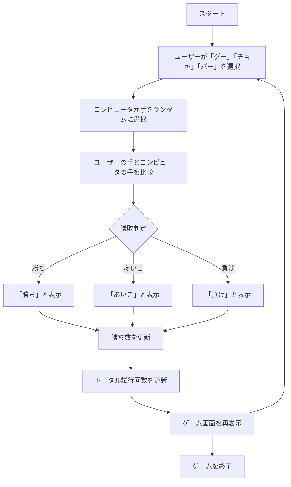
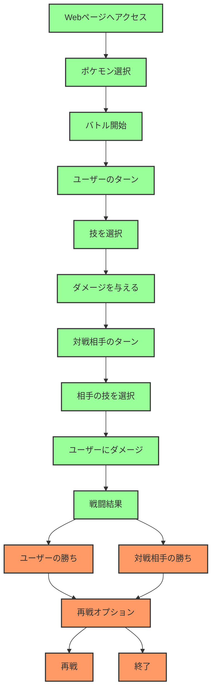
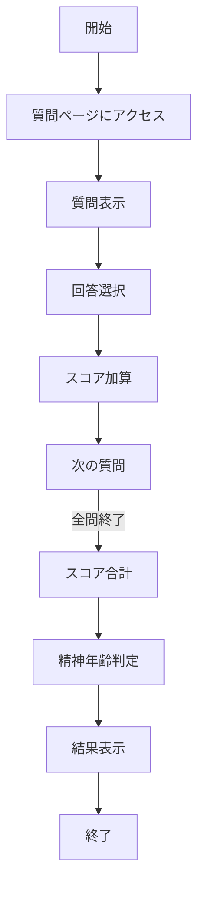

# webpro_06

# ファイル一覧(janken)
ファイル名|説明
-|-
app5.js|プログラム本体.
janken.ejs| ゲーム画面を表示する.
win.ejs| 勝数と試行回数を表示する.

##仕様書
1.サーバーの起動方法
　ターミナルを開き,cdコマンドでapp5.jsが入っているファイルに移動する.まず,「npm install ejs を実行することで,Node.jsでEJSを使用してテンプレートファイルをレンダリングできるようになります.その次に,サーバを起動するためにnodeコマンドを使い[node app5.js]と入力し実行することでローカルサーバーを起動する.このとき[App running on http://localhost:3000]と出ていれば正しく起動できている.また,サーバーを終了させるにはcontrol + cを押す.

2.ゲームの使い方
ユーザーが「グー」「チョキ」「パー」のいずれかの手を選択する.
コンピュータの手はランダムに決定する.
ユーザーの手とコンピュータの手を比較し、勝敗を決定する.
ユーザーが勝った場合: 「勝ち」
同じ手の場合: 「あいこ」
ユーザーが負けた場合: 「負け」
勝敗結果を表示し,勝ち数およびトータル試行回数を更新する.
ユーザーの手,コンピュータの手,勝敗の結果,勝ち数,トータル試行回数を表示する.
ユーザーは「グー」「チョキ」「パー」のボタンをクリックして,次の手を選ぶ.
/janken ルートで,ユーザーの選択（hand）とコンピュータの選択を受け取り、勝敗を判定する.
勝敗の結果を基に,win と total を更新する.
更新されたデータを EJS テンプレートに渡し,動的に表示を更新する.
win：現在の勝ち数を保持する変数.
total：現在のトータル試行回数を保持する変数.
勝敗の結果に応じて,これらのデータはサーバーサイドで更新される.
勝敗結果が表示された後,ユーザーは再度「グー」「チョキ」「パー」のいずれかを選択することで,次の対戦を開始できる.

# ファイル一覧(pokemon)
ファイル名|説明
-|-
app6.js|プログラム本体
pokemon.ejs|ポケモン選択画面.
battle.ejs|バトル画面.

## 仕様書
1.サーバーの起動方法
　ターミナルを開き,cdコマンドでapp6.jsが入っているファイルに移動する.まず,「npm install ejs を実行することで、Node.jsでEJSを使用してテンプレートファイルをレンダリングできるようになります.その次に,サーバを起動するためにnodeコマンドを使い[node app6.js]と入力し実行することでローカルサーバーを起動する.このとき[App running on http://localhost:3000]と出ていれば正しく起動できている.また,サーバーを終了させるにはcontrol + cを押す.
2.ゲームの使い方
ゲームがブラウザで表示されたら、最初にプレイヤーが使用するポケモンを選択する.選べるポケモンはこの3匹.ヒトカゲ (HP: 120)ゼニガメ (HP: 130)フシギダネ (HP: 150)
好きなポケモンを選び,「バトル開始」ボタンをクリックすると,バトルが始まる.
プレイヤーと相手ポケモンが交互に技を使って戦う.
バトルが開始されたら,自分のポケモンの持っている技を選択する.各ポケモンは4つの技を持つ.技を選ぶと,その技で相手ポケモンを攻撃する.
プレイヤーが技を使った後,相手ポケモンが反撃してくる.相手はランダムに1つの技を選んで自分のポケモンに攻撃を仕掛けてくる.
戦闘が続き,いずれかのポケモンのHPが0になるとバトルが終了する.
勝者: 相手ポケモンのHPが0になった場合,プレイヤーのポケモンが勝利となる.敗者: プレイヤーのポケモンのHPが0になった場合、プレイヤーは負けとなる.
バトル終了後,再戦することができる.「再戦」ボタンをクリックすると,再度ポケモンが選ばれ,新たなバトルが始まる.
再戦で,ポケモンのHPが初期値にリセットされ,再び戦いがはじまる.
ゲームが終了した後,ブラウザを閉じることでゲームを終了することができる.

# ファイル一覧(seisinn)
精神年齢診断システム
ファイル名|説明
-|-
app7.js|プログラム本体
index.ejs|質問と選択肢のページ.
result.ejs|精神年齢の結果ページ.

## 仕様書
1.サーバーの起動方法
　ターミナルを開き,cdコマンドでapp7.jsが入っているファイルに移動する.まず,「npm install ejs を実行することで,Node.jsでEJSを使用してテンプレートファイルをレンダリングできるようになります.その次に,サーバを起動するためにnodeコマンドを使い[node app7.js]と入力し実行することでローカルサーバーを起動する.このとき[Example app listening on port 3000!]と出ていれば正しく起動できている.また,サーバーを終了させるにはcontrol + cを押す.
2.診断方法
ユーザーの回答に基づいて精神年齢を診断する.最大スコアは65で,これに基づいて精神年齢が判定される.
質問ごとにスコアが設定され,回答に応じてスコアが加算される.精神年齢はスコアに基づいて以下のように分類される：
0～10: 若杉11～20: 地味に若杉21～30: まあ普通31～40: ませているな41～50: 大人びてきた51～60: 非常に大人びている61以上: パーフェクトアダルト
好みや価値観に関する質問（例: 「好きな食べ物は？」）,生活スタイルや心の状態に関する質問（例: 「休日の過ごし方は？」）.
ユーザーの選択肢に基づいてスコアを加算し,合計スコアに応じて精神年齢を判定する.全問回答後にスコアが算出され,精神年齢が表示される.
質問ページ → ユーザーが回答 → スコア加算 → 次の質問 → 全問終了 → スコア計算 → 精神年齢判定 → 結果表示.
 

