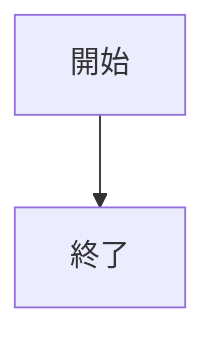
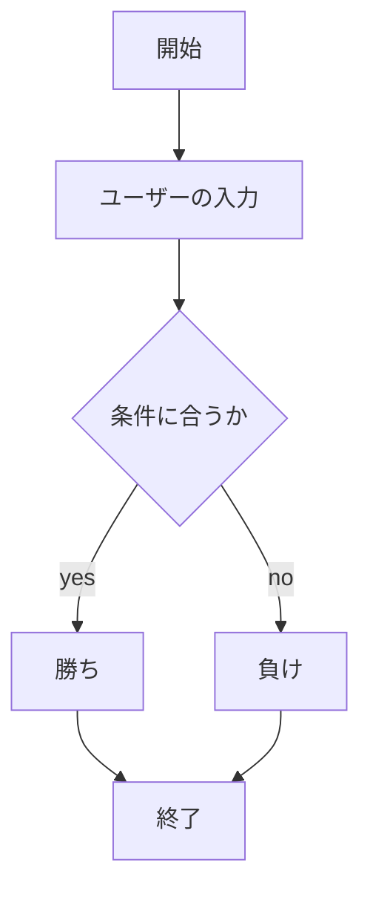
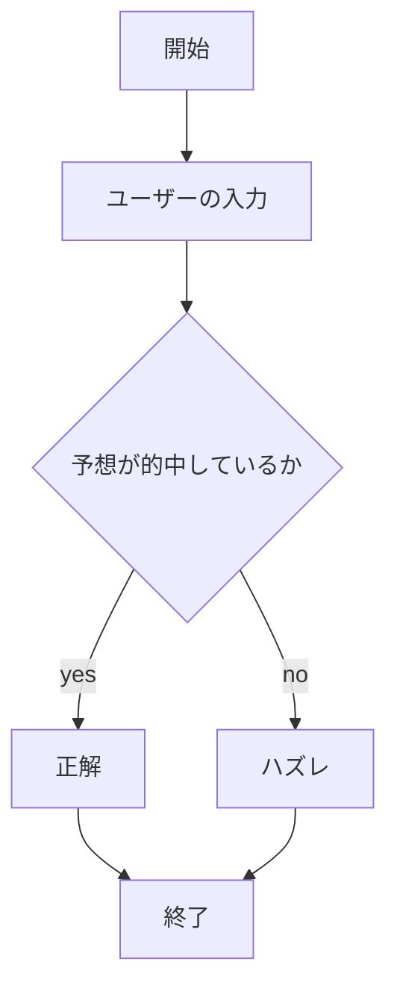
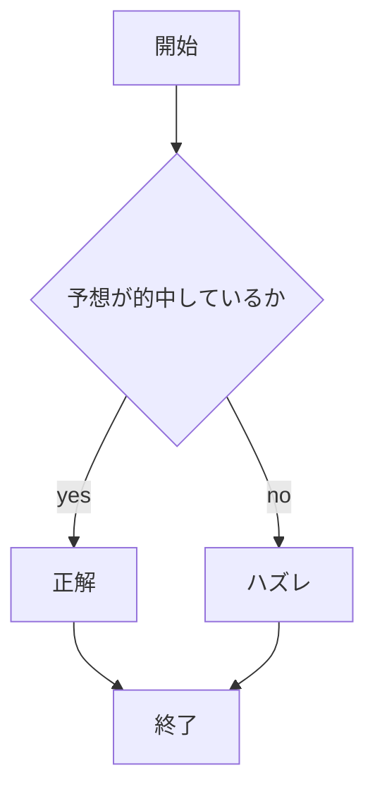

# webpro_06
10/29
# webpro06
##　このプログラムについて
# ファイル一覧

ファイル名|説明
-|-
app5.js|プログラム本体
public/janken.html|じゃんけん開始画面
janken.ejs|じゃんけんファイル
```javascript
1.共通ファイル　app5.js
const express = require("express");
const app = express();

app.set('view engine', 'ejs');
app.use("/public", express.static(__dirname + "/public"));

app.get("/hello1", (req, res) => {
  const message1 = "Hello world";
  const message2 = "Bon jour";
  res.render('show', { greet1:message1, greet2:message2});
});

app.get("/hello2", (req, res) => {
  res.render('show', { greet1:"Hello world", greet2:"Bon jour"});
});

app.get("/icon", (req, res) => {
  res.render('icon', { filename:"./public/Apple_logo_black.svg", alt:"Apple Logo"});
});

app.get("/luck", (req, res) => {
  const num = Math.floor( Math.random() * 6 + 1 );
  let luck = '';
  if( num==1 ) luck = '大吉';
  else if( num==2 ) luck = '中吉';
  console.log( 'あなたの運勢は' + luck + 'です' );
  res.render( 'luck', {number:num, luck:luck} );
});

app.get("/janken", (req, res) => {
  let hand = req.query.hand;
  let win = Number( req.query.win )||0;
  let total = Number( req.query.total )||0;
  console.log( {hand, win, total});
  const num = Math.floor( Math.random() * 3 + 1 );
  let cpu = '';
  if( num==1 ) cpu = 'グー';
  else if( num==2 ) cpu = 'チョキ';
  else cpu = 'パー';
  // ここに勝敗の判定を入れる
  let judgement = '';
  if((hand=='グー' && cpu=='チョキ')||
  (hand=='チョキ' && cpu=='パー')||
  (hand=='パー' && cpu=='グー')){
    judgement ='勝ち';
    win +=1;
  } else if (hand === cpu) {
  judgement = 'あいこ';
} else {
  judgement = '負け';
}

  // 今はダミーで人間の勝ちにしておく


  total += 1;
  const display = {
    your: hand,
    cpu: cpu,
    judgement: judgement,
    win: win,
    total: total
  }
  res.render( 'janken', display );
});

app.get('/number', (req,res) => {
  let number = req.query.number;
  let win = Number( req.query.win )||0;
  let total = Number( req.query.total )||0;
  console.log( {number, win, total});
  const num = Math.floor( Math.random()* 3+1);
let cpu = '';
if( num==1 ) cpu = '1';
else if( num==2 ) cpu = '2';
else if( num==3 ) cpu = '3';
let judgement='';
if ((number == '3' && cpu == '3') || (number == '2' && cpu == '2')) {
  judgement='正解';
win +=1;}
  else{
    judgement = 'ハズレ';
  }


  total += 1;
  const display = {
    your: number,
    cpu: cpu,
    judgement: judgement,
    win: win,
    total: total
  }
  res.render( 'number', display );
});

app.get('/whether', (req,res) => {
  let whether = req.query.whether;
  let win = Number( req.query.win )||0;
  let total = Number( req.query.total )||0;
  console.log( {whether, win, total});
  const num = Math.floor( Math.random()* 3+1);
let cpu = '';
if( num==1 )cpu = '晴れ';
else if( num==2 )cpu = '曇り';
else if( num==3 ) cpu = '雨';
let judgement='';
if ((whether === cpu)){
  judgement='正解';
win +=1;}
  else{
    judgement = 'ハズレ';
  }
  total += 1;
  const display = {
    your: whether,
    cpu: cpu,
    judgement: judgement,
    win: win,
    total: total
  }
res.render( 'whether', display );
});


app.listen(8080, () => console.log("Example app listening on port 8080!"));

2.janken.html
<!DOCTYPE html>
<html lang="ja">
<head>
    <meta charset="UTF-8">
    <title>じゃんけん</title>
</head>
<body>
    <form action="/janken">
        <input type="text" name="hand" required>
        <label for="hand">何を出す？</label>
        <input type="submit" values="じゃんけん　ポン">
        <input type="hidden" name="win" value="0">
        <input type="hidden" name="total" value="0">
    </form>
</body>
</html>

3.janken.ejs
<!DOCTYPE html>
<html lang="ja">
<head>
    <meta charset="UTF-8">
    <title>じゃんけん</title>
</head>
<body>
    <p>あなたの手は<%= your %>です．</p>
    <p>コンピュータは<%= cpu %>です．</p>
    <p>判定：<%= judgement %></p>
    <p>現在<%= total %>試合中<%= win %>勝しています．</p>
    <hr>
    <form action="/janken">
        <input type="text" name="hand" required>
        <label for="hand">次は何を出す？</label>
        <input type="hidden" name="win" value="<%= win %>">
        <input type="hidden" name="total" value="<%= total %>">
        <input type="submit" values="じゃんけん　ポン">
    </form>   
</body>
</html>

```
## 仕様書
1. ```app5.js``` をnodeでポート開放行う
1. 他のターミナルでポートにアクセスする
1. Webブラウザでlocalhost:8080/public/janken.htmlにアクセスする
1. 自分の手を入力する




ファイル名|説明
-|-
app5.js|プログラム本体
public/number.html|数予想開始画面
number.ejs|数予想ファイル

```javascript

1.number.html
<!DOCTYPE html>
<html lang="ja">
<head>
    <meta charset="UTF-8">
    <title>数予想
    </title>
</head>
<body>
    <form action="/number">
        <input type="text" name="number" required>
        <label for="number">何を出す？</label>
        <input type="submit" values="じゃんけん　ポン">
        <input type="hidden" name="win" value="0">
        <input type="hidden" name="total" value="0">
    </form>
</body>
</html>

2.number.ejs
<!DOCTYPE html>
<html lang="ja">
<head>
    <meta charset="UTF-8">
    <title>数予想</title>
</head>
<body>
    <p>あなたの数は<%=your %>です.</p>
    <p>コンピュータの手は<%= cpu %>です．</p>
    <p>判定：<%= judgement %></p>
    <p>現在<%= total %>試合中<%= win %>勝しています．</p>
    <hr>
    <form action="/number">
        <input type="text" name="number" required>
        <label for="hand">次は何を出す？</label>
        <input type="hidden" name="win" value="<%= win %>">
        <input type="hidden" name="total" value="<%= total %>">
        <input type="submit" values="じゃんけん　ポン">
    </form>   
</body>
</html>
```

## 仕様書
1.```app5.js``` をnodeでポート開放行う
1. 他のターミナルでポートにアクセスする
1. Webブラウザでlocalhost:8080/public/number.htmlにアクセスする
1. コンピュータが出す数を予想する
1. 連続的中数とゲーム数が表示されるので,ゲームを続ける




```javascript
1.whether.html
<!DOCTYPE html>
<html lang="ja">
<head>
    <meta charset="UTF-8">
    <title>天気予想
    </title>
</head>
<body>
    <form action="/whether">
        <input type="text" name="whether" required>
        <label for="whether">何を出す？</label>
        <input type="submit" values="じゃんけん　ポン">
        <input type="hidden" name="win" value="0">
        <input type="hidden" name="total" value="0">
    </form>
</body>
</html>

2.whether.ejs
<!DOCTYPE html>
<html lang="ja">
<head>
    <meta charset="UTF-8">
    <title>天気予想</title>
</head>
<body>
    <p>あなたの予想は<%= your %>です.</p>
    <p>明日の天気は<%= cpu %>です．</p>
    <p>判定：<%= judgement %></p>
    <p>現在<%= total %>回中<%= win %>回的中しています．</p>
    <hr>
    <form action="/whether">
        <input type="text" name="whether" required>
        <label for="whether">明日の天気は？</label>
        <input type="hidden" name="win" value="<%= win %>">
        <input type="hidden" name="total" value="<%= total %>">
        <input type="submit" values="じゃんけん　ポン">
    </form>   
</body>
</html>

```


## 仕様書
1.```app5.js``` をnodeでポート開放行う
1. 他のターミナルでポートにアクセスする
1. Webブラウザでlocalhost:8080/public/whether.htmlにアクセスする
1. 明日の天気を予想する
1. 連続的中数とゲーム数が表示されるので,ゲームを続ける

